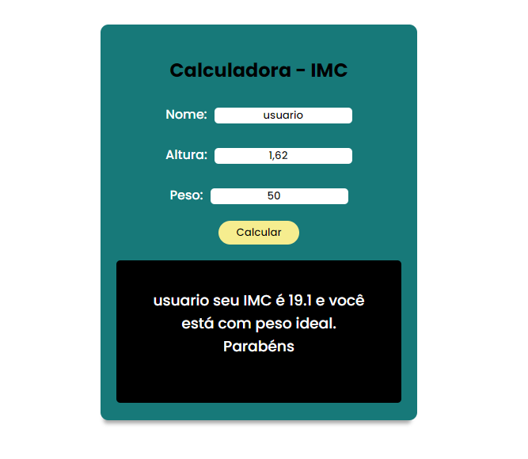

# Calculadora IMC
nesse projeto eu aprendi a fazer calculos de imc usando javascript

## Tecnologias
+ HTML
+ CSS
+ JAVASCRIPT

## Screenshot

    

### Programa Funcionando
<a href = "https://trizcamp.github.io/calculadora-imc/">clique aqui para ver o repositório prático</a>
